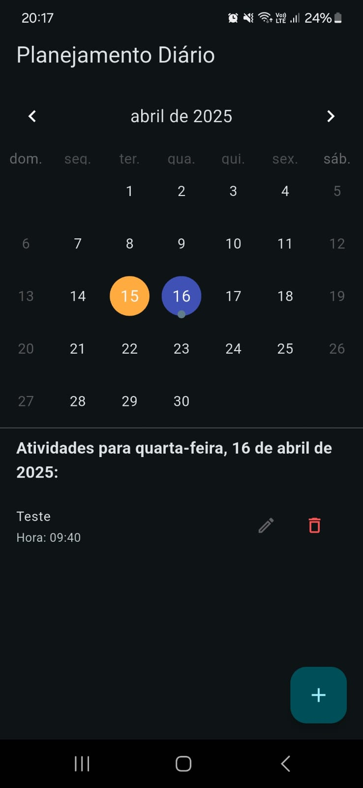
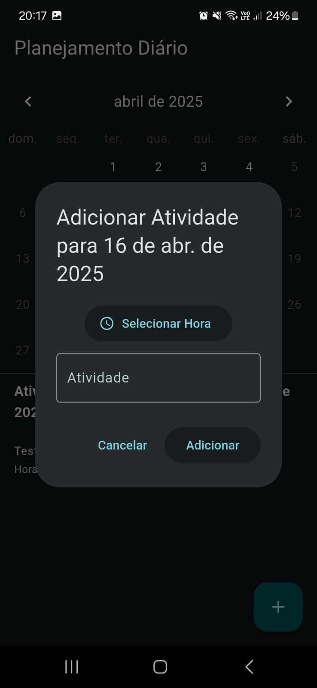
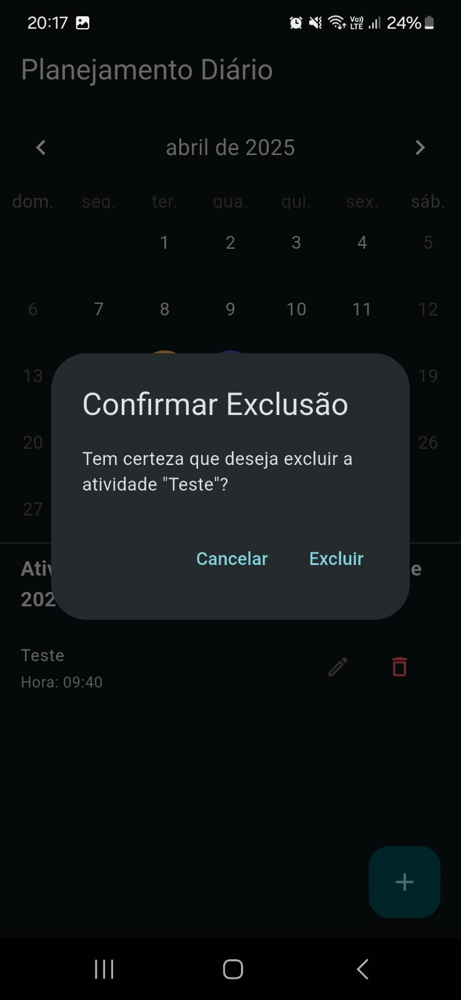

# Planejador Diário

## Descrição

Planejador Diário é um aplicativo Flutter simples projetado para ajudar os usuários a organizar suas
atividades diárias. Ele apresenta uma visualização de calendário onde os usuários podem selecionar
um dia específico para visualizar, adicionar, editar ou excluir tarefas agendadas para essa data. As
atividades são armazenadas localmente no dispositivo usando `shared_preferences`.

## Capturas de Tela

|               Tela do Calendário               |                 Diálogo de Adicionar Atividade                 |                  Diálogo para Confirmar Exclusão                  |
|:----------------------------------------------:|:--------------------------------------------------------------:|:-----------------------------------------------------------------:|
|  |  |  |

## Funcionalidades

* **Visualização de Calendário:** Exibe um calendário mensal interativo (`table_calendar`).
* **Seleção de Dia:** Permite ao usuário selecionar um dia específico no calendário.
* **Gerenciamento de Atividades:**
    * Lista as atividades agendadas para o dia selecionado, ordenadas por hora.
    * Permite adicionar novas atividades com descrição e hora específica.
    * Permite editar a descrição e a hora de atividades existentes.
    * Permite excluir atividades existentes com confirmação.
* **Persistência Local:** Salva e carrega as atividades usando `shared_preferences`, garantindo que
  os dados não sejam perdidos ao fechar o aplicativo.
* **Localização:** Interface e formatação de data/hora configuradas para Português do Brasil (
  pt_BR).

## Tecnologias Utilizadas

* **Flutter:** Framework de UI para construir aplicativos compilados nativamente para mobile, web e
  desktop a partir de uma única base de código.
* **Dart:** Linguagem de programação utilizada pelo Flutter.
* **`table_calendar`:** Pacote para exibir um calendário altamente personalizável.
* **`intl`:** Pacote para internacionalização e localização, usado aqui para formatar datas e horas
  e definir o locale pt_BR.
* **`shared_preferences`:** Pacote para armazenamento persistente de dados simples (chave-valor)
  localmente no dispositivo.

## Instalação e Execução

Siga estas etapas para configurar e executar o projeto localmente:

1. **Pré-requisitos:**
    * Certifique-se de ter o [Flutter SDK](https://flutter.dev/docs/get-started/install) instalado
      em sua máquina (versão recomendada: 3.x ou superior).
    * Um editor de código como [VS Code](https://code.visualstudio.com/) (com extensões Flutter e
      Dart) ou [Android Studio](https://developer.android.com/studio).
    * Um emulador Android configurado, um dispositivo físico conectado ou um navegador.

2. **Clonar o repositório:**
   ```bash
   git clone <URL_SEU_REPOSITORIO>
   cd <NOME_DO_DIRETORIO_DO_PROJETO>
   ```

3. **Instalar dependências:**
   Execute o seguinte comando no terminal, dentro do diretório do projeto:
   ```bash
   flutter pub get
   ```

4. **Executar o aplicativo:**
   Certifique-se de que um dispositivo, emulador ou navegador esteja em execução e execute:
   ```bash
   flutter run
   ```

O aplicativo deverá ser compilado e iniciado no seu dispositivo android, emulador ou navegador
selecionado.